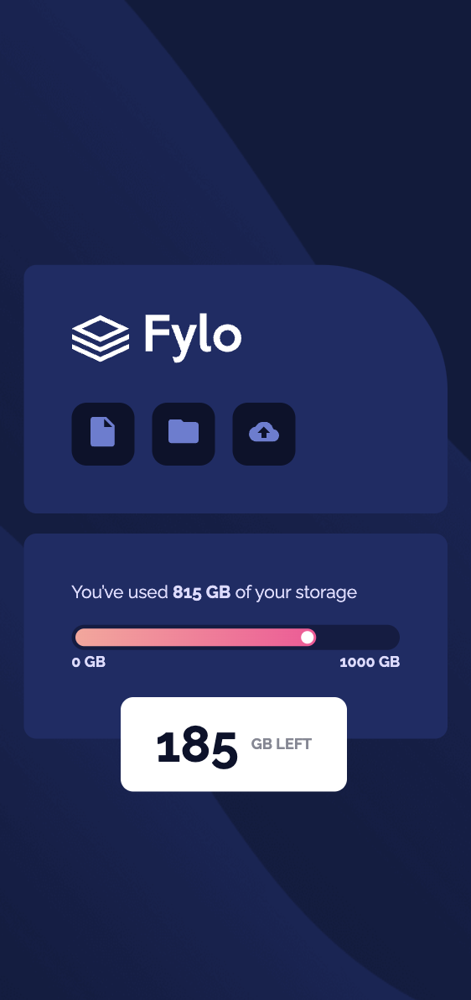

This is a solution to the Fylo data storage component

## Table of contents

- [Overview](#overview)
  - [Screenshot](#screenshot)
  - [Links](#links)
- [My process](#my-process)
  - [Built with](#built-with)
  - [What I learned](#what-i-learned)
  - [Continued development](#continued-development)
- [Author](#author)

## Overview

Data storage component with layout depending on device's screen size.
In this priject I use simple SASS architecture with layour, conponents, base and colors separated in different files.

Storage line starts from to 75% of whole space-line with animation.

### Screenshot

#### Desktop version of layout

#### Little tablet and mobile layout

### Links

- Live Site URL: https://Fylo-storage-component-nadiafr.netlify.app/

## My process

### Built with

- Semantic HTML5 markup
- SASS architecture (sass variables, @mixins ..)
- Flexbox
- Animation in css

### What I learned

- SASS architecture for little card projects

### Continued development

Responsive layout using SASS.

## Author

Nadia Furzikova - front-end developer,
based 📍 Nancy/France
